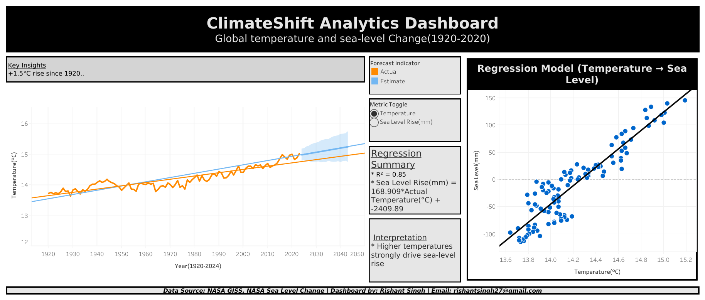

# ClimateShift Analytics Dashboard

This project analyzes 100 years of NASA climate data (1920–2024) to explore global 
temperature rise, sea-level trends, and their relationship.

## 🔗 Live Dashboard  
View the interactive Tableau dashboard:  
https://public.tableau.com/app/profile/rishant.singh/viz/ClimateShiftAnalyticsDashboardfinal/Dashboard2

## 📸 Dashboard Preview

## 📊 Key Insights
- Global temperature increased by ~1.5°C since 1920  
- Sea levels rose by ~146 mm  
- Strong correlation between warming and rising sea levels (R² ≈ 0.85)  
- Warming accelerated significantly after 1980  

## 🛠 Tools Used
- Tableau  
- Python (Pandas)  
- NASA GISS & NASA Sea Level datasets  

## 📁 Project Structure
data/        → cleaned dataset  
dashboard/   → Tableau dashboard screenshot   
README.md    → project documentation  

## 👤 Author
Rishant Singh  
